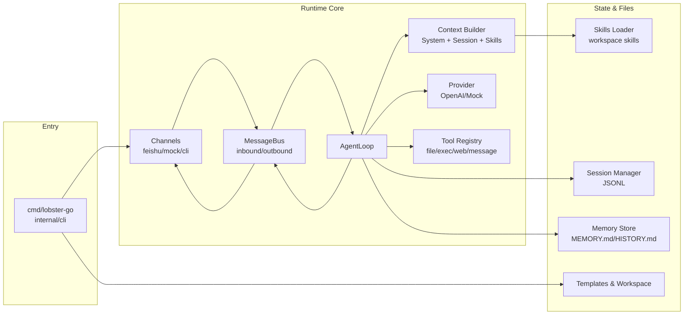
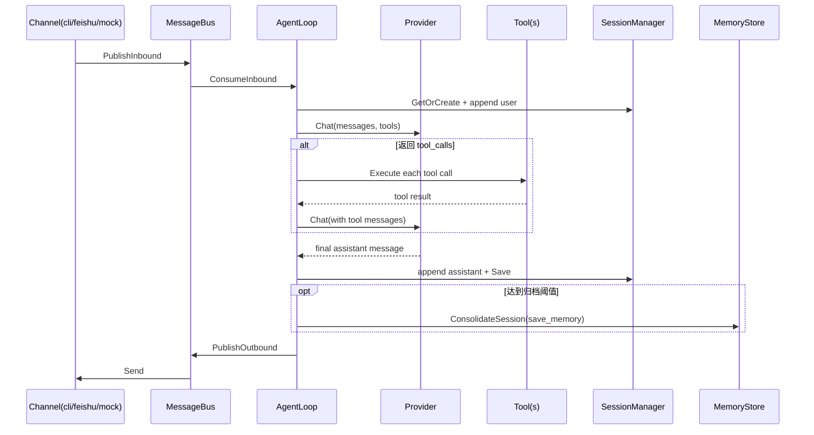

# lobster-go

`lobster-go` 是一个用 Go 实现的轻量级 AI Agent 框架。它围绕“消息总线 + AgentLoop + 工具调用 + 会话/记忆持久化”构建，支持 CLI 交互、Gateway 长服务、Feishu/Mock 通道接入，并提供可测试、可扩展的工程骨架。

## 项目目标

- 对齐 openclaw 这类 Agent 的核心能力（消息处理、工具调用、记忆归档、通道适配）
- 用 Go 的单二进制形态降低部署和运维复杂度
- 通过清晰分层和测试体系保证可演进性
- 对openclaw token使用量过高的问题进行优化， 每次对话都会显示token使用量 命中缓存量

## 核心能力

- CLI 命令：`onboard` / `agent` / `session list` / `cron` / `heartbeat` / `gateway` / `version`
- Provider 抽象：`OpenAIProvider` + `MockProvider`
- AgentLoop：
  - 消费消息并构造上下文
  - 支持同轮多个 tool call 执行
  - provider 报错、空回复、最大迭代兜底
  - token/延迟等 metadata 回传
- 内置工具：
  - `list_dir` / `read_file` / `write_file`
  - `exec`（超时 + 黑名单 + 输出截断）
  - `web_fetch` / `web_search`(stub)
  - `send_message`
- Session 持久化：JSONL（含内存缓存、历史读取、legacy 迁移）
- Memory 系统：`memory/MEMORY.md` + `memory/HISTORY.md`，支持 `window` / `archive_all` 归档模式
- 通道层：`FeishuChannel`（WebSocket/Webhook）+ `MockChannel`
- 模板与工作区初始化：`AGENTS.md`、`TOOLS.md`、`USER.md`、`SOUL.md`、`HEARTBEAT.md`、`memory/*`
- 测试体系：单元测试 + e2e（build tag）

## 架构总览



## 消息处理时序



## 分层说明

### 1) 入口与命令层

- `cmd/lobster-go/main.go`：程序入口
- `internal/cli`：命令路由与运行模式
  - `onboard`：初始化 `~/.lobster/config.json` 和 `~/.lobster/workspace`
  - `agent`：本地交互模式（Line UI / TUI）
  - `gateway`：长服务模式，接入通道并可启动 webhook HTTP
  - `session list` / `cron` / `heartbeat` / `version`

### 2) 运行时核心

- `internal/bus`：进程内消息队列（inbound/outbound）
- `internal/agent`：Agent 主循环、工具注册与调用、异常兜底
- `internal/agent/context`：构建上下文，注入 system prompt 与 skills 概览
- `internal/providers`：LLM Provider 抽象与 OpenAI 实现（含 stream 解析和 tool call 适配）
- `internal/agent/tools`：内置工具集合

### 3) 状态与持久化

- `internal/session`：会话 JSONL 存储、缓存、读取与迁移
- `internal/memory`：`MEMORY.md` 和 `HISTORY.md` 归档管理
- `internal/templates`：工作区模板同步
- `internal/skills`：workspace/builtin skill 发现与摘要

### 4) 通道与服务

- `internal/channels`：
  - `FeishuChannel`：鉴权、去重、收发
  - `MockChannel`：本地联调与测试
- `internal/gateway`：装配 Agent + Channel + heartbeat/cron
- `internal/heartbeat` / `internal/cron`：周期任务服务

## 目录结构

```text
.
├── cmd/lobster-go/           # 程序入口
├── internal/
│   ├── agent/                # AgentLoop、上下文、工具
│   ├── bus/                  # 消息总线
│   ├── channels/             # Feishu/Mock 通道
│   ├── cli/                  # 命令与交互界面
│   ├── config/               # 配置加载/保存
│   ├── cron/                 # 定时任务服务
│   ├── gateway/              # 运行时装配
│   ├── heartbeat/            # 心跳服务
│   ├── memory/               # MEMORY/HISTORY 归档
│   ├── providers/            # OpenAI/Mock Provider
│   ├── session/              # Session 持久化
│   ├── skills/               # Skill 发现与摘要
│   ├── templates/            # 模板同步
│   └── version/              # 版本
├── pkg/                      # 通用库(logging/utils)
├── test/e2e/                 # 端到端回归测试
├── install.sh                # 构建安装脚本
└── README.md
```

## 快速开始

### 1. 环境要求

- Go `1.22+`

### 2. 运行测试

```bash
go test ./...
```

若本机有 Go cache 权限限制：

```bash
GOCACHE=/tmp/go-build GOMODCACHE=/tmp/go-mod go test ./...
```

运行 e2e：

```bash
go test -tags=e2e ./test/e2e/...
```

### 3. 初始化

```bash
go run ./cmd/lobster-go onboard
```

初始化后会创建：

- `~/.lobster/config.json`
- `~/.lobster/workspace`
- `~/.lobster/workspace/{AGENTS.md,TOOLS.md,USER.md,SOUL.md,HEARTBEAT.md,memory/*,skills/,history/}`

### 4. 运行方式

```bash
# 查看版本/帮助
go run ./cmd/lobster-go version
go run ./cmd/lobster-go help

# 本地交互
go run ./cmd/lobster-go agent

# 会话列表
go run ./cmd/lobster-go session list

# 定时与心跳服务
go run ./cmd/lobster-go cron
go run ./cmd/lobster-go cron list
go run ./cmd/lobster-go heartbeat

# Gateway 模式（通道接入）
go run ./cmd/lobster-go gateway
go run ./cmd/lobster-go gateway --port 18790 --workspace ~/.lobster/workspace
```

### 5. 安装脚本

```bash
./install.sh
# 或
./install.sh --skip-tests --bin-dir ~/.local/bin
```

## 配置说明

默认配置文件：`~/.lobster/config.json`（支持 `camelCase` / `snake_case`）。

```json
{
  "providers": {
    "openai": {
      "apiKey": "sk-xxx",
      "baseUrl": "https://api.openai.com/v1/chat/completions",
      "model": "gpt-4.1"
    }
  },
  "agents": {
    "defaults": {
      "provider": "openai",
      "model": "gpt-4.1",
      "temperature": 0.1,
      "maxTokens": 4096,
      "llmTimeoutSec": 120,
      "maxHistoryMessages": 50,
      "promptCacheKey": "session",
      "promptCacheRetention": ""
    }
  },
  "tools": {
    "restrictToWorkspace": true,
    "execTimeoutSec": 120
  },
  "services": {
    "cronIntervalSec": 60,
    "heartbeatIntervalSec": 30
  },
  "memory": {
    "consolidateEvery": 20,
    "windowSize": 50,
    "mode": "window"
  },
  "channels": {
    "mock": {
      "enabled": false,
      "name": "mock"
    },
    "feishu": {
      "enabled": false,
      "appId": "",
      "appSecret": "",
      "useWebhook": false,
      "useCard": false,
      "allowFrom": ["*"]
    }
  }
}
```

## 数据与文件

- 会话：JSONL 文件（`session.Manager` 管理）
- 长期记忆：
  - `memory/MEMORY.md`（可覆盖更新）
  - `memory/HISTORY.md`（追加日志）
- 模板：首次 `onboard` 生成，不覆盖已存在文件

## 扩展点

- 新增 Provider：实现 `providers.Provider` 接口并接入 `BuildProvider`
- 新增 Tool：实现 `agent.Tool` 接口并 `RegisterTool`
- 新增 Channel：实现 `channels.Channel` 并在 `gateway.Build` 装配
- 新增 Skill：放到 workspace `skills/<name>/SKILL.md`，由 `skills.Loader` 自动发现

## 已知边界

- `web_search` 当前是 stub，仅返回占位结果
- Feishu webhook 模式下仅处理明文事件（加密 payload 尚未支持）
- e2e 测试需要显式 `-tags=e2e`

## 版本

当前版本：`0.0.1-pre`（`internal/version/version.go`）
